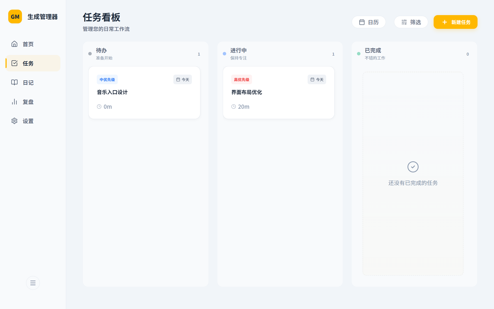
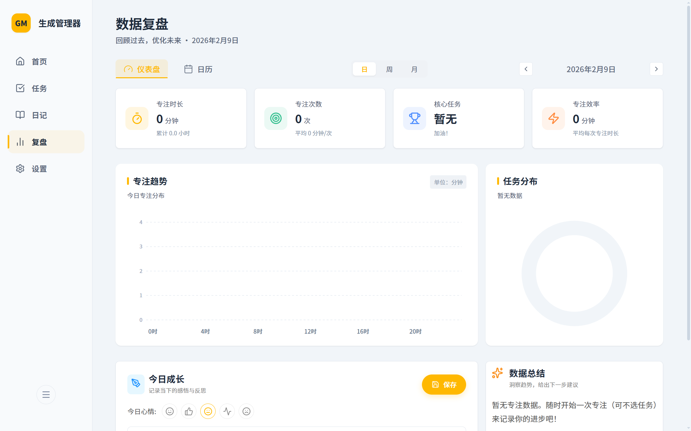
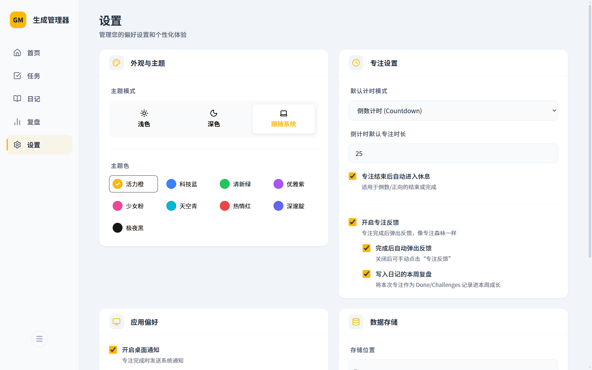

# 生成管理器

基于 Electron + Vite + React + TypeScript 的桌面应用，用来把「任务、日记、专注、复盘」放在一个地方，数据默认本地存储。


## 截图

| 任务看板 | 数据复盘 | 设置（含数据目录） |
| --- | --- | --- |
|  |  |  |

## 功能概览

- 任务：创建与管理任务
- 日记：记录与回顾
- 专注：计时器与专注流程
- 复盘：数据统计与趋势查看
- 数据存储：在设置页可查看并更改数据目录（会复制数据库与日志到新位置，旧位置不删除）

## 技术栈

- Electron
- Vite + React
- TypeScript
- Zustand
- SQLite（better-sqlite3）

## 本地开发

环境要求：Node.js（建议 18+）

```bash
npm install
npm run dev
```
