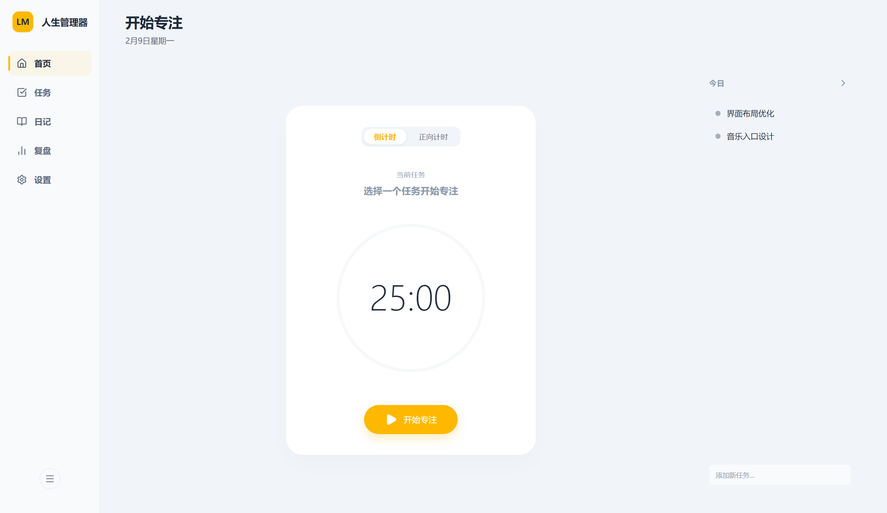
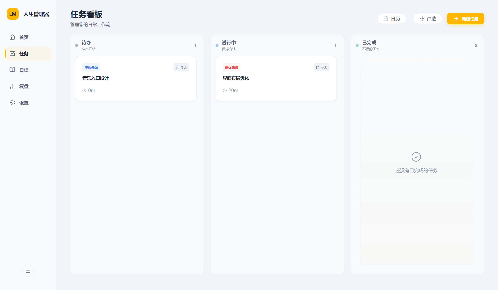
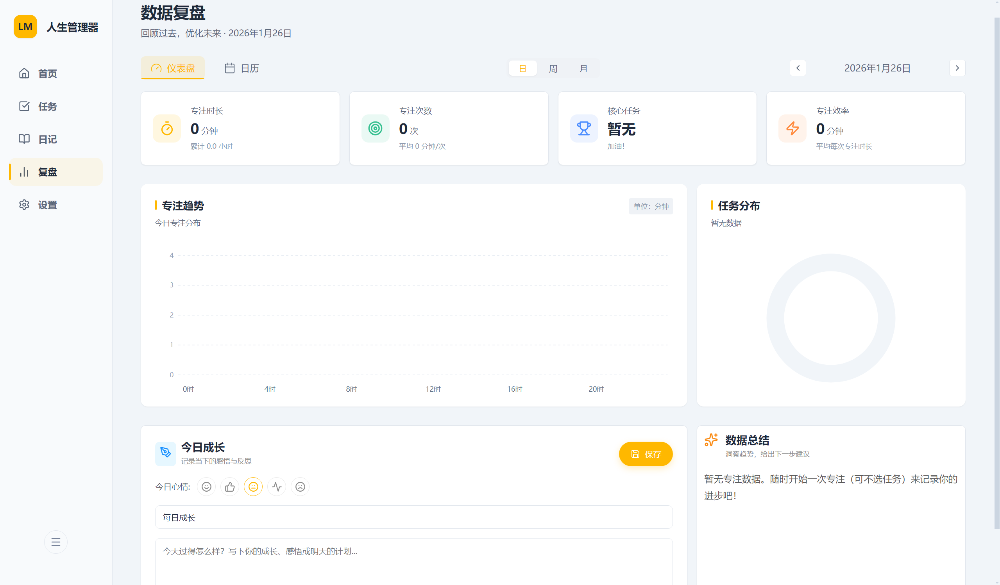
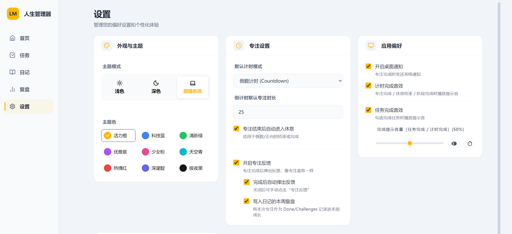
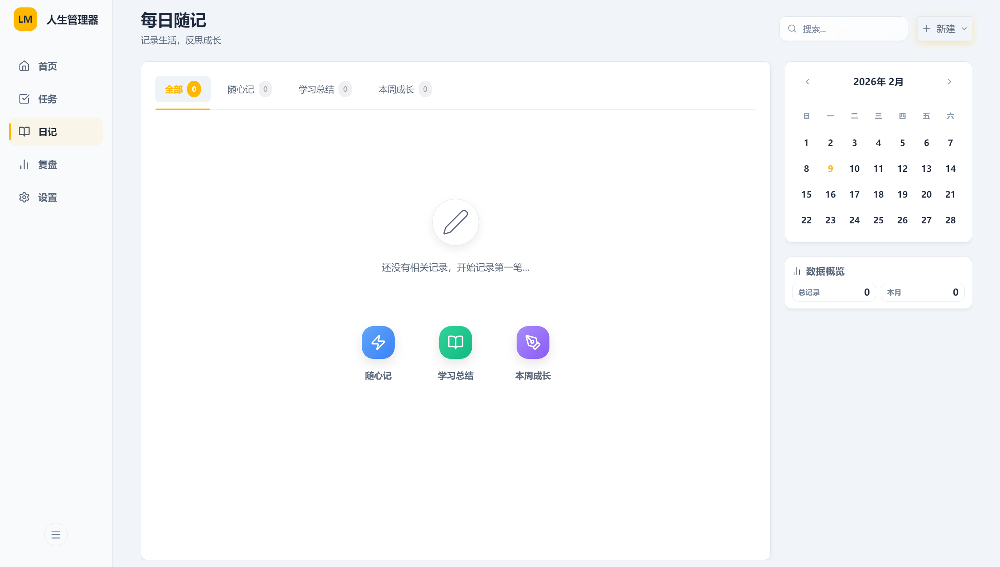
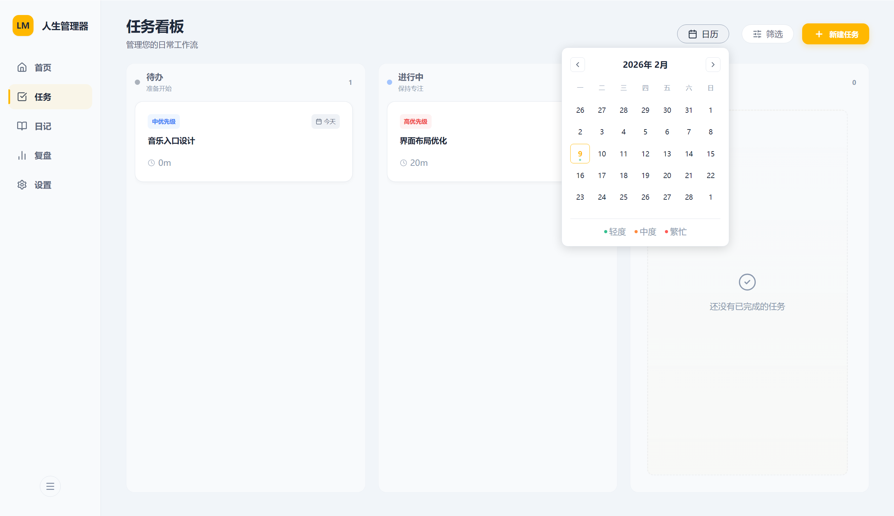
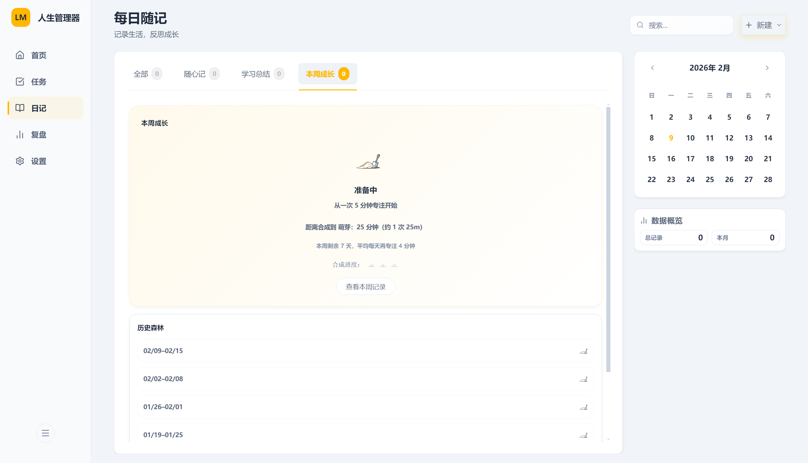

# 人生管理器

把「任务、专注、复盘」放在一个地方的桌面效率工具，数据默认本地存储。



## 你能用它做什么（核心 3 项）

- 任务管理：创建与管理待办，形成清晰的执行队列
- 专注计时：从首页一键开始专注，支持倒计时/正向计时与全屏专注
- 数据复盘：用统计与趋势图回顾专注与任务完成情况，优化下一步

## 界面预览

| 任务看板 | 复盘图表与总结 | 设置（含数据目录） |
| --- | --- | --- |
|  |  |  |

- 首页（主图）：专注入口 + 模式切换 + 今日任务，降低开始成本
- 任务看板：按状态组织任务（待办/进行中/已完成），聚焦当天执行。也可以预览未来任务安排
- 日记（每日随记）：按日期记录生活与思考，支持在「全部 / 随心记 / 学习总结 / 本周成长」四个分类之间切换浏览；右侧提供日历定位与数据概览，并支持搜索与一键新建，方便快速回顾与整理。
- 复盘：用图表与总结聚合专注/任务数据，便于回顾与调整。用视图来查看任务分布于专注情况。
- 设置：主题/偏好集中管理；支持查看并更改数据存储目录（会复制数据库与日志到新位置，旧位置不删除）

### 更多截图

| 日记页面 | 任务未来预览 | 复盘过去任务 |
| --- | --- | --- |
|  |  |  |

| 本周成长专注 |
| --- |
|  |

## 技术栈

- Electron
- Vite + React
- TypeScript
- Zustand
- SQLite（better-sqlite3）

## 本地开发

环境要求：Node.js（建议 18+）

```bash
npm install
npm run dev
```

## 构建与打包

```bash
npm run lint
npm run typecheck
npm run test:shared
```

```bash
npm run build
```

构建输出：

- 渲染进程：`dist/`
- Electron 主进程/预加载：`dist-electron/`
- 安装包/产物：`release/<version>/`

提示：PowerShell 里不建议用 `&&` 串联命令，可以用分号：

```bash
npx tsc; npx vite build; npx electron-builder
```

## 项目结构

- `electron/`：Electron 主进程与 preload
- `src/main/`：主进程业务（数据层 / IPC / 服务）
- `src/renderer/`：渲染进程（React UI）
- `tests/`：共享逻辑与 UI 测试

## 上传到 GitHub（更新代码）

```bash
git add .
git commit -m "feat: update"
git push
```

## 上传安装包（发布给别人下载）

推荐使用 GitHub Releases：仓库页面 → Releases → Draft a new release → 上传 `release/<version>/` 下的安装包（.exe）作为附件（Assets）。
